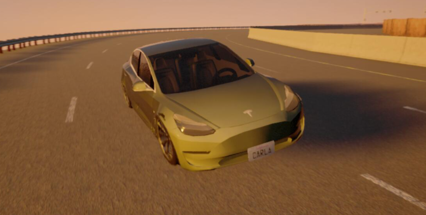
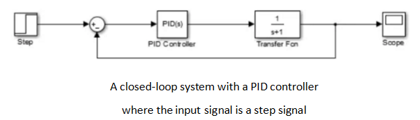

# ROAR:Robot Open Autonomous Racing

This article was written by Deng Shuwen, Wu Zheyuan, Zang Linfeng  and describes what they did for the racing, collection by Yu qiushuang.





## Table of contents
1. [Summary](#summary)
1. [Design](#design)
    1. [Planning](#design_planning)
    1. [Controlling](#design_control)
1. [Implementation](#implementation)
    1. [Planning](#impl_planning)
	1. [Controlling](#impl_control)
1. [Results](#resluts)
1. [Conculsion](#conclusion)
    1. [Strength and weakness](#conclu_strength_and_weakness)
    1. [Possible improvements](#conclu_possible_improvements)

1. [Team](#team)
1. [Additional materials](#add_mats)


## Summary <a name="summary"></a>

This year, we were invited to [Berkeley’s ROAR competition](https://vivecenter.berkeley.edu/research1/roar/), in which teams race 1/10th scale self-driving cars in a digital platform with a fixed racing track.The end goal of this competition is to maximize the speed in premise of ensuring minimal (acceptable) collisions.

To accomplish this goal, we spent two weeks improving our car’s performance. For the first week, we worked individually with regular online communication and managed to optimize our waypoints. For the second week, we spent two days working collaboratively and improved all the other things, including the structure of PID controller, look-ahead values and K values.

The final result showed its effectiveness. The maximum single lap time was 77.15s, while the total 10-lap time was 1104s. Because of the considerable speed, we were fortunate enough to win the second place and the Fastest Lap Time Award in this year’s 2020 ROAR S1 series .

However,though the car indeed ran with considerable speed, there are still places for improvement. Firstly, the conditions of activating the configuration conditions are too specific, meaning that for a different race track, it may be less effective. Also, the configurations of PID controller are mostly empirical. Moreover, our waypoints are not optimal. These problems result in occasional collisions, possibility of failure, and lower speed.

To further improve the performance, we suggest using machine learning methods for configurations, trying different waypoints, and generalizing the conditions for using mathematical methods.

Due to a lack of time we didn’t implement these methods, but we have published our codes in [Github](https://github.com/Trance-0/ROAR.git). 


## Design <a name="design"></a>

From the original codes we know that the car essentially used a PID controller to control the vehicle to track the path (a sequence of waypoints). The platform can provide us information including current speed, position, the value of steering and throttle. 

Base on the above conditions, we provide two ways to improving the project.

- Rebuilding a better waypoint text file which can make sure a better way for car to following.
- Connecting the steering and throttle with the actual coordinates of the car.

So we split the task into 3 parts-planning, controlling, racing.


### Planning <a name="design_planning"></a>

Initially, we use waypoints provided by the original codes.,However, during the test, we found a severe problem with this set of waypoints. During simulation, in the third turn and the following long straight track,  the car following these  waypoints would experience a sharp turning.  Meanwhile, The speed would also sharp down. Through observation, we found that the reason for this phenomenon was that the car trended speeding up on the straight track, while the  waypoints provided by the original codes  were unevenly distributed and sparse, resulting in  improper selection of the next waypoint . .Since the PID controller adopted by the car directly controlled steering and throttle based on waypoints without considering the actual motion of the car, a poor selection of waypoints would cause sharp changes in steering and throttle, leading to oscillation of the car.

Moreover, to increase the car’s speed waypoints can be further optimized based on two principles:

- While in straight tracks, drive as close as possible to the inside lane.(especially for the first turn)
- Minimize the turning radius.

Therefore, in the planning module, we needed to create a set of waypoints that was more evenly distributed and intensive. Because the only  obstacles other than walls i were three stationary NPC cars, stationary gasoline barrels , we did not use additional sensors (RGB cameras, etc.) and perception modules to generate the waypoints. 
Instead, waypoints were manually generated with a waypoint generating agent `ROAR/agent_module/special_agent/waypoint_generating_agent.py` .


### Controlling <a name="design_control"></a>

The control unit of the car receives the coordinates of the next waypoint and the target speed. Based on these data, the controller would then calculate the difference between the coordinates of the current position and the target position as well as between the current speed and the target speed.

#### PID controller

The PID controller was provided to us, which is actually a control algorithm that works on a closed-loop system that consists of three parts, namely, the P proportional part  , the I integral part, and the D differential part.
The loop was as followed:

```
{
 error = target value - actual value
P output is Kp * error
I output += Ki*  error
D output =Kd * ( error - last error) /* Because the software implementation is discrete, differential */ is replaced by difference
PID output = P output +I output +D output
Last error =  error /* Update the last error value before each cycle ends */
}
```

We can use Simulink componet in MATLAB to simulate the system with PID and review the role of each PID link in controlling the system.Using MARLAB, we can have a more intuitionistic understanding of how PID controller works.




We can see that the curve in the original system tends to equilibrium half way from the target value 1 after 3s.